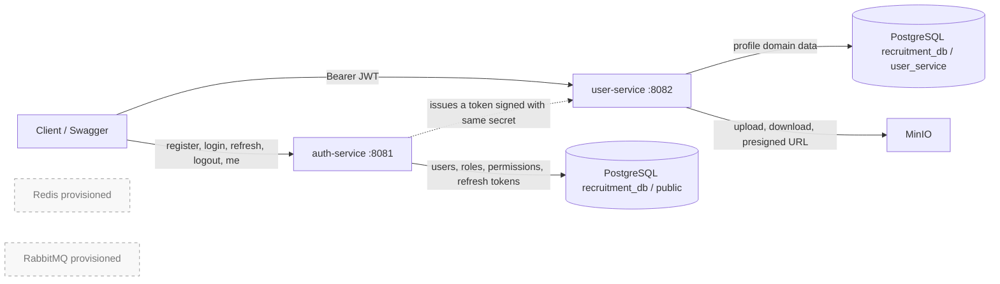

# Architecture Review — RecruitmentSystem

**Review date:** 2026-07-27  
**Scope:** source, build files, Flyway migrations, Docker/infrastructure files, existing test reports and Git history in this repository.  
**Boundary:** this is an as-is architecture review. No production code, configuration or schema was changed as part of the review.

## 1. Executive summary

The repository is a recruitment-platform **target architecture** laid out as eight backend service folders. The running implementation is currently much narrower: `auth-service` and `user-service` are the only services with Java source; the other six service folders, the frontend, API gateway and common library are empty placeholders.

The implemented system is therefore best described as **two independently bootable Spring Boot applications sharing one PostgreSQL database and one JWT signing secret**, not yet an operational microservice platform. `auth-service` owns account authentication/authorization data in the PostgreSQL default (`public`) schema; `user-service` owns candidate-profile data in the `user_service` schema. There is no implemented gateway, service discovery, synchronous service client, event producer/consumer, Redis client, or RabbitMQ client.

The user-profile domain is substantially implemented (profile, CV data, preferences and MinIO assets). Authentication is implemented at a first-version level (registration, login, refresh token rotation, logout, `/me`, roles/permissions). The largest enterprise gaps are identity/access enforcement for user-scoped routes, secret management, deployment topology, observability, automated testing, and the absence of the advertised downstream business services.

## 2. Evidence reviewed

The review covered all authored Java source under `backend/*/src`, all 20 Flyway migration files, Maven POMs, application configuration, infrastructure Compose/env/scripts, root documentation and recent Git history. Generated `target/` bytecode/source was not treated as authored source.

| Area | Findings |
|---|---|
| Auth Java source | 35 production classes plus one minimal context-load test |
| User Java source | 135 production classes; no committed test source |
| Migrations | Auth V1–V6; User V1–V14 (15 validation entries because baseline is present) |
| Backend folders | 8 named service folders; only 2 contain code |
| Infrastructure | PostgreSQL 17, Redis 8, RabbitMQ 4-management, MinIO; Compose files for backend/frontend/dev are empty |
| Git history | latest commits complete auth v1 and user-profile module |

## 3. Repository structure and delivery status

```text
RecruitmentSystem/
├─ backend/
│  ├─ auth-service/                 implemented Spring Boot service (port 8081)
│  ├─ user-service/                 implemented Spring Boot service (port 8082)
│  ├─ api-gateway/                  empty placeholder
│  ├─ application-service/          empty placeholder
│  ├─ company-service/              empty placeholder
│  ├─ recruitment-service/          empty placeholder
│  ├─ notification-service/         empty placeholder
│  ├─ ai-service/                   empty placeholder
│  └─ common-lib/                   empty placeholder
├─ frontend/                        empty
├─ infrastructure/
│  ├─ compose/docker-compose.infrastructure.yml
│  ├─ env/                          PostgreSQL/Redis/RabbitMQ/MinIO development credentials
│  ├─ postgres/init/init.sql
│  └─ scripts/                      start, stop and reset PowerShell scripts
├─ database/, docs/, storage/       currently empty (except this review document)
├─ docker-compose*.yml              empty root files
└─ README.md                        empty
```

`backend/pom.xml` is not a multi-module aggregator; it is effectively another standalone `auth-service` POM (packaging defaults to JAR and no `<modules>` list). Each implemented service has its own independent Maven build. The only verified tests are `AuthServiceApplicationTests` (context-load shape) and the historic report that manually verified `GET user-service /api/v1/health`.

## 4. Service responsibilities

| Module | Actual responsibility / status |
|---|---|
| `auth-service` | **Implemented.** Account registration, BCrypt password verification, login, stateless JWT access tokens, persisted refresh tokens, logout, current-user query, role/permission persistence and OpenAPI. |
| `user-service` | **Implemented.** Candidate profile and related career objective, education, experience, skills, languages, certificates, social links, candidate preferences and MinIO-backed profile assets. |
| `api-gateway` | Folder only; no routing, TLS termination, token relay, rate limit or aggregation code. |
| `company-service` | Folder only; no employer/company domain. |
| `recruitment-service` | Folder only; no job/vacancy domain. |
| `application-service` | Folder only; no candidate application/workflow domain. |
| `notification-service` | Folder only; no email/SMS/push or message consumer. |
| `ai-service` | Folder only; no recommendation/matching implementation. |
| `common-lib` | Folder only; no shared contract, error model, security starter, event schema or BOM. |

## 5. Current logical architecture and data flow



### Authentication/profile flow

1. A client registers or logs in through `auth-service`. A new registration gets the seeded `CANDIDATE` role. Login deletes previous refresh-token records and creates a new access/refresh pair.
2. The access JWT carries `sub` (email), `userId`, `email` and `roles`, and is HMAC-signed by the configured shared secret. Refresh tokens are JWTs but are also stored in `refresh_tokens`; refresh revokes the old row and creates a replacement.
3. `user-service` independently verifies the same signing secret and constructs `CurrentUser` from JWT claims. It does not call `auth-service` or check token revocation.
4. Profile operations persist in `user_service`; binary assets are stored in MinIO and metadata in `profile_assets`.

There is no event flow. In particular, registration does not create a profile automatically, profile changes do not update Auth's `avatar_url`, and logout/refresh revocation is not propagated to `user-service` access-token validation.

## 6. Code conventions currently used

### Package and layering

Both services use the root package `com.recruitment.<service>` and a conventional package-by-technical-layer layout: `config`, `controller`, `dto.request`, `dto.response`, `entity`, `repository`, `service`, `security`, `exception`, `common`; `user-service` also has `mapper` and `service.storage`. Controllers are thin request/response adapters, services contain transactional domain operations, repositories extend Spring Data JPA, and MapStruct maps user entities to response DTOs.

Class naming is Java/PascalCase; fields/methods are camelCase; database identifiers are snake_case. Controllers are plural resource paths under `/api/v1`; request types use `CreateXRequest`/`UpdateXRequest`, response types use `XResponse`, and repositories use `XRepository`.

### DTO and mapping

`auth-service` uses Lombok DTO classes and constructs its response DTOs manually. `user-service` uses Lombok DTOs, separate request/response packages and MapStruct `@Mapper(componentModel = "spring")` interfaces. Many user response and update DTOs are compressed to one physical line, which is syntactically valid but inconsistent with the formatting of the rest of the codebase.

Validation is controller-bound through `@Valid` and Jakarta Bean Validation annotations (`@NotBlank`, `@Size`, `@Email`, `@Pattern`, numeric/date bounds). Database check constraints additionally guard date and salary ranges. Validation coverage is uneven: several update DTOs inherit a create DTO and only add a `version`; cross-field rules are chiefly service/database checks.

### Entity, repository and persistence conventions

Entities use UUID identifiers and `@Entity`/`@Table`, enums with string persistence, JPA relations and Lombok. Auth's `BaseEntity` has `id`, `created_at`, `updated_at`; user-service's richer base adds soft-delete/audit columns (`deleted_at`, `created_by`, `updated_by`, `deleted_by`) and an optimistic-lock `version`. User entities model relations in JPA and use repository query methods for ownership filtering/pagination; the migrations add the concrete FK/unique/index constraints.

`auth-service` uses eager `User.roles` and `Role.permissions` many-to-many relations. `user-service` declares cascades/orphan removal on the profile aggregate. Logical deletes are implemented explicitly: services set `deletedAt` and repository query methods consistently include `DeletedAtIsNull`; auth persistence is physical.

### Response and exception format

Each service duplicates an `ApiResponse<T>` envelope with `success`, `code`, `message`, optional `data`, `timestamp`, and `path`. Success code is `SUCCESS`.

Auth has a typed `ErrorCode` enum and `BusinessException`; all its exception paths return the envelope. User has `ResourceNotFoundException` plus a broader advice. Its validation handler returns `Map<String,Object>` while other handlers return `ApiResponse`, so the external error contract is not fully uniform across all paths or services. Paging endpoints directly expose Spring `Page<T>` even though a `PageResponse` DTO exists.

### Security and JWT

Both services are stateless Spring Security applications with CSRF disabled, bearer parsing via `OncePerRequestFilter`, and Swagger/OpenAPI public. Auth uses a `DaoAuthenticationProvider` and DB-backed `CustomUserDetails`; user-service trusts claims, builds `JwtAuthenticationToken` and has no user lookup.

Auth's endpoint policy explicitly allows register/login/refresh/health/docs and requires authentication for `/me`/logout. User permits health, actuator and docs; all business routes require an authenticated JWT. Neither service has an explicit application CORS policy bean. Auth enables method security but no `@PreAuthorize` checks are used. In user-service there are no role/permission checks and no comparison of `{userId}` routes to the JWT `userId`; consequently any authenticated principal can target another known user UUID on the resource controllers. This is an insecure direct object reference exposure in the current implementation.

JWT details: HMAC signing uses JJWT and a secret set directly in both committed application files; access expiry is one hour and refresh expiry seven days. Tokens carry roles but permissions are not embedded or evaluated. Auth's JWT filter reloads the DB user for each protected request; user-service does not reject a token whose user is disabled, whose roles have changed, or whose refresh session is revoked before access-token expiry.

### Flyway and OpenAPI

Both services set Hibernate `ddl-auto: validate` and Flyway migrations under `classpath:db/migration`. User correctly pins its own schema/history table; auth has no configured schema and uses the default schema/history table. Both publish `/v3/api-docs` and `/swagger-ui.html` using springdoc 2.8.9, with a bearer scheme configured. Controller annotations describe operations, but there is no API-contract generation/version compatibility process.

## 7. Database review

### Ownership and physical topology

One database, `recruitment_db`, is shared. This is schema separation, not database-per-service: Auth tables are in `public`; user profile tables are in `user_service`. There are no foreign keys across schemas and no connection from an Auth `users.id` row to `user_service.profiles.user_id`; the relationship is an application-level UUID convention.

### Auth schema (`public`)

| Tables | Relationships |
|---|---|
| `users` | user has unique email, enabled/verified state and audit timestamps |
| `roles`, `permissions` | role/permission master data |
| `user_roles` | user ↔ role many-to-many, cascading FKs |
| `role_permissions` | role ↔ permission many-to-many, cascading FKs |
| `refresh_tokens` | many tokens per user; token unique, expiry and revoked state |

Migrations enable `uuid-ossp`/`pgcrypto`, create the schema and indexes, add `refresh_tokens.updated_at`, seed roles (`ADMIN`, `EMPLOYER`, `CANDIDATE`), seed an admin, and seed permissions. `V4` seeds `USER_*` and `JOB_*` permissions while `V6` adds overlapping/renamed `*_WRITE` permissions and an `ADMIN` permission. This produces an ambiguous permission catalogue. Only `ADMIN` role receives the `V4` permissions; V6 does not grant its newly seeded values to roles.

### User schema (`user_service`)

| Aggregate/table | Key fields/relationship |
|---|---|
| `profiles` | one profile per external `user_id`; display/contact/location, visibility/status, completion score |
| `career_objectives`, `candidate_preferences` | one-to-one with profile |
| `educations`, `experiences`, `certificates`, `social_links`, `profile_assets` | many-to-one profile (social link unique by profile/type) |
| `skills`, `languages` | shared reference/master records |
| `profile_skills`, `profile_languages` | profile-to-master association with unique pair and proficiency |

All user-domain tables have UUID primary keys, audit/soft-delete/version columns, and profiles’ child FKs use `ON DELETE CASCADE` (profile-assets’ optional certificate FK uses `SET NULL`). Migrations include practical indexes and check constraints for education, experience, certificate date ranges and candidate salary bounds. `V14` renames three experience fields to align schema with entity/API (`employer_name`, `job_title`, `location`), and V13 adds achievements.

## 8. Infrastructure and runtime posture

The only nonempty Compose definition is `infrastructure/compose/docker-compose.infrastructure.yml`. It provisions PostgreSQL, Redis, RabbitMQ and MinIO on a bridge network with named volumes and health checks. PostgreSQL bootstrap only creates database/extensions; it leaves application DDL to Flyway. MinIO is used by user-service and auto-creates a bucket.

Redis and RabbitMQ are currently unused dependencies at the code/build level. No service Compose definitions exist: root `docker-compose.yml`, `docker-compose.dev.yml`, `docker-compose.prod.yml` and the backend/frontend/dev Compose fragments are zero bytes. There are no Dockerfiles, CI workflows, environment profile YAMLs, Kubernetes manifests, centralized configuration, tracing, metrics export configuration, log correlation, or backup/restore automation in the reviewed source.

## 9. Completeness assessment

| Capability | Status | Review evidence |
|---|---|---|
| Infrastructure primitives | Locally complete | Compose and scripts; historic Sprint 3.1 report records health validation |
| Authentication/roles | Implemented, limited verification | Auth CRUD flows and migrations exist; tests are minimal |
| Candidate profile | Implemented, not E2E proven | 135 Java source files, 14 domain migrations, MinIO integration; historic report validated health only |
| API gateway/frontend | Not started | empty folders/files |
| Company/jobs/applications/notifications/AI | Not started | named folders are empty |
| Cross-service contracts/events | Not started | no client/event code or shared library |
| Automated quality assurance | Not started/insufficient | one auth context test; no meaningful unit, integration, security, contract or E2E tests |

## 10. Enterprise architecture assessment

### Strengths

- Clear initial bounded contexts for identity and candidate profile; profile schema is relatively well normalized and constrained.
- Java 21, Spring Boot 3.5, PostgreSQL, Flyway, JPA validation, OpenAPI, UUIDs, optimistic locking, transactional services and MinIO are solid technology choices for this scope.
- User-service has a useful aggregate shape, soft-delete/audit columns, explicit migrations and MapStruct separation from API DTOs.
- The infrastructure isolates stateful platform services with health checks, named volumes and a dedicated Docker network.

### Material risks/gaps (current state, not proposed changes)

1. **Critical — broken object-level authorization:** all authenticated callers can use user-scoped `{userId}` profile-resource routes; role claims are not enforced anywhere in user-service.
2. **Critical — secrets committed in source:** PostgreSQL, MinIO, Redis/RabbitMQ credentials and a shared JWT signing key are in tracked config/env files. The same symmetric JWT key is deployed to issuer and resource service.
3. **High — not independently deployable microservices:** applications share one database, service identity is coupled by a cross-schema UUID convention, and Auth uses `public` rather than a dedicated schema/database. There is no operational service topology or gateway.
4. **High — token lifecycle boundaries are incomplete:** user-service validates signature only. It has no issuer/audience validation, key rotation, revocation/disabled-account awareness or centralized authorization decision.
5. **High — absent service implementation:** six planned core services and all integration mechanisms are placeholders, so end-to-end recruitment journeys cannot be delivered.
6. **High — low verification confidence:** no meaningful automated tests; existing user-service report expressly states that protected business endpoints were not E2E tested.
7. **Medium — API contract drift:** duplicated response/error/security code, inconsistent validation error response, raw `Page`, and no shared library/contract governance make later services likely to diverge.
8. **Medium — production operations missing:** no backend container build/deploy definitions, TLS/ingress, environment segregation, centralized configuration, audit/event strategy, rate limits, metrics/traces/log correlation, or CI/CD evidence.
9. **Medium — database ownership ambiguity:** Auth migration history/objects default to `public`, while user-service segregates its schema. The shared physical database expands blast radius and makes ownership permissions/backup/restore separation unclear.
10. **Medium — data consistency gaps:** profile initialization is client-driven; no transaction/event creates it after registration. Auth `avatar_url` and user-service asset metadata can diverge. Binary-storage/database actions are not atomically coordinated.
11. **Low/medium — maintainability inconsistencies:** duplicate POM behavior, empty root files, unused `AuthServiceProperties`, unused Redis/RabbitMQ, unpinned `minio/minio:latest`, and migration permission duplication signal incomplete integration.

## 11. Questions requiring product/architecture clarification before design proposals

The following cannot be safely inferred from the repository and should be resolved before any design change is proposed:

1. Is the intended deployment model an incremental modular monolith with schemas, or genuinely independently deployable microservices with database ownership per service?
2. Which user roles may read, create, update and delete candidate profile resources: only the profile owner, employers under consent, administrators, recruiters, or another policy?
3. Which system is authoritative for identity/profile fields duplicated in concept (name, phone, email, avatar), and should profile creation be synchronous at registration or eventual through an event?
4. Is a gateway/BFF required for every external request, and which clients (candidate web, employer web, admin, mobile, partner) are in scope?
5. Is JWT revocation/disabled-account enforcement required immediately across services, and what are the required issuer/audience/key-rotation/SSO constraints?
6. What are the data-classification, retention, consent, deletion, malware-scanning and download-access requirements for CV/certificate assets?
7. Which of the six placeholder services are actually in the next release boundary, and what are the canonical ownership/event contracts among them?
8. What availability, RPO/RTO, audit, observability, rate-limit and compliance obligations define the target enterprise tier?

## 12. Review conclusion

The codebase has a credible foundation for an authentication service and a candidate-profile service, but it has not yet crossed the boundary into a complete microservice recruitment system. The next architecture decision must first settle deployment/data ownership and authorization policy; without those answers, detailed design recommendations would be speculative. This review intentionally stops at the observed state and the clarification points above.
