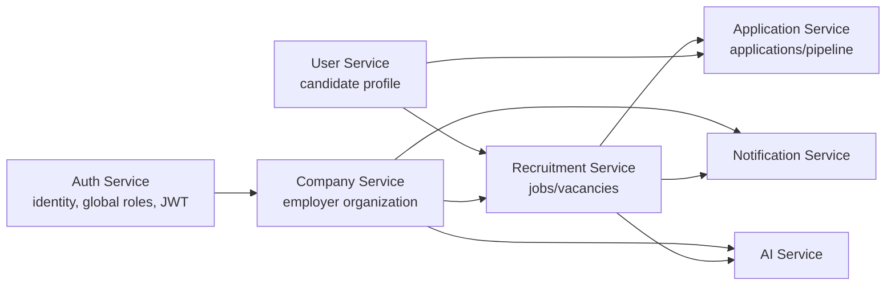
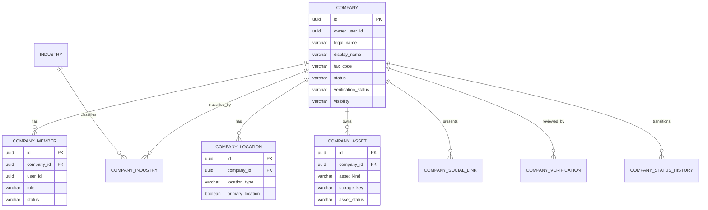

# Company Service Architecture & Development Plan

**Role:** Technical Architecture + Product Architecture design  
**Status:** Design baseline before implementation; no code is included or implied.  
**Inputs:** Architecture Review, Company Service Development Guideline, and current repository state as of 2026-07-27.

## 0. Scope, assumptions and design boundary

The current repository has a functional Auth Service and candidate-oriented User Service. `company-service`, Recruitment Service, Application Service, Notification Service and AI Service are placeholders. This document therefore separates **MVP decisions** from intentionally deferred integration details.

### Explicit assumptions to validate with product owner

1. A user with `EMPLOYER` role may create/manage one or more companies; a company can have multiple employer members with different permissions.
2. A company is an organization/employer profile, not a job posting. Jobs belong to Recruitment Service.
3. A candidate is identified by the Auth `userId`; their public professional profile is owned by User Service.
4. The platform is Vietnam-first in MVP, so province/district codes and Vietnamese company registration/tax-code fields are useful, while international expansion is deferred.
5. Company verification is a manual admin workflow in MVP; automated governmental verification is out of scope.
6. Company assets are stored in MinIO using Company Service-owned object keys; public/secure delivery policy is controlled by Company Service.
7. Auth remains the issuer of access tokens and the source of global account role. Company membership is an organization-scoped role owned by Company Service.

Any assumption that changes permission ownership, multi-tenancy, verification requirements, or data retention must be resolved before Sprint 2. It changes the data model and API contract materially.

---

## 1. Responsibility in the overall recruitment platform

Company Service is the authoritative **Employer Organization** context. It represents the legal/brand identity of an employer, the employer’s ability to administer that organization, company public information, verification and lifecycle status, locations, benefits/culture presentation, and company-owned documents/assets.

It answers questions such as:

- Who is the employing organization behind a vacancy?
- Is that organization active and verified enough to publish jobs?
- Which employer accounts may manage it, and at what organization-level permission?
- What public company profile, locations, benefits and media should candidates see?

It does not become a generic user-profile, job-board, application-tracking or messaging service.

## 2. Mandatory Company Service business capabilities

### 2.1 Employer organization lifecycle

- Create an employer company as a draft or pending-verification organization.
- Maintain legal and display identity: legal name, display name, tax/registration code, company type, scale, industry, founded year, website and description.
- Manage lifecycle: `DRAFT`, `PENDING_VERIFICATION`, `VERIFIED`, `REJECTED`, `SUSPENDED`, `ARCHIVED`.
- Permit an authorized admin to review/verify/reject/suspend; retain a reason and timestamp for decisions.
- Publish/unpublish a public company profile subject to verification/lifecycle rules.

### 2.2 Company profile and employer brand

- Manage company overview, short description, detailed description, culture, benefits, working-hours and website/social links.
- Manage one primary headquarters and zero or more branches/work locations.
- Manage industry/category labels in a controlled reference model.
- Manage logo, cover image, gallery/media and verification documents through MinIO metadata records.

### 2.3 Organization membership and organization-level authority

- Invite/add/remove employer members by Auth `userId`.
- Assign company-scoped membership roles (`OWNER`, `ADMIN`, `RECRUITER`, `VIEWER`) independent of global Auth role.
- Transfer ownership through an explicit controlled workflow.
- Ensure a non-archived company always has exactly one active owner.

### 2.4 Recruitment-facing company capability

- Provide an internal, stable company summary and eligibility status for Recruitment Service to attach a job to a company.
- Provide company public profile data for job detail/search presentation.
- Notify dependent services when lifecycle/public profile changes affect job visibility.

## 3. Capabilities explicitly outside Company Service

| Capability | Correct owner | Reason |
|---|---|---|
| Registration/login/password/MFA/refresh tokens/global `ADMIN`/`EMPLOYER`/`CANDIDATE` roles | Auth Service | Identity and global access boundary. |
| Candidate CV, skills, education, preferences, profile visibility | User Service | Candidate Profile bounded context already exists. |
| Job posting, job draft, job requirements, salary, vacancy lifecycle, job search index | Recruitment Service | A vacancy is a recruitment product, not company master data. |
| Candidate application, CV snapshot submitted, screening stage, interview pipeline, offer | Application Service | Transaction/application lifecycle needs its own aggregate and audit trail. |
| Email/SMS/push/in-app delivery, templates and retry | Notification Service | Cross-cutting asynchronous delivery concern. |
| Candidate-job matching, recommendation, resume parsing, company scoring | AI Service | Compute/model context; Company only supplies approved data. |
| Payment, subscriptions, invoices, job-credit wallet | Future Billing Service | Financial ledger must not be embedded in company profile. |
| Global taxonomy governance if shared across jobs/candidates/companies | Future Catalog/Reference Service | Avoid multiple services competing to own industry/location taxonomy. |

Company Service may consume references or publish facts for these concerns, but does not own their workflows.

## 4. Bounded Context and aggregate design

### 4.1 Bounded Context

**Employer Organization Management** is bounded by a company’s identity, employer brand, eligibility, organization membership and company-owned locations/assets. The boundary ends at the company reference exposed to Recruitment Service.

`companyId` is the tenant/ownership boundary for all company resources. `authUserId` is an external identity reference, not a locally managed User entity. Company Service never joins Auth/User tables.

### 4.2 Aggregate roots

| Aggregate root | Why it is an aggregate | Invariants it protects |
|---|---|---|
| `Company` | Organization identity/lifecycle/public profile | legal/display identity, lifecycle transitions, verification/publication eligibility, exactly one active owner policy |
| `CompanyMember` | Membership authorization has a high-integrity lifecycle | one membership per company/user, membership role, owner transfer and deactivation rules |
| `CompanyAsset` | Asset upload/activation/deletion must be controlled independently | storage metadata, ownership, type/status, one active logo/cover policy |

`CompanyLocation`, `CompanySocialLink` and `CompanyIndustry` are child entities/value-like records of `Company`. They are modified through the Company aggregate/service boundary in MVP. They do not need independent cross-service identity semantics.

Avoid loading every child collection to mutate an aggregate: use repository methods and bounded transactions while preserving invariants.

## 5. Entity model and relationships

### 5.1 Required entities

| Entity | Purpose | MVP |
|---|---|---|
| `Company` | master organization, lifecycle and public employer-brand profile | Yes |
| `CompanyMember` | mapping to Auth user ID with organization role/status | Yes |
| `CompanyLocation` | headquarters/branch/worksite | Yes |
| `CompanyIndustry` | association between company and controlled industry category | Yes |
| `Industry` | Company Service reference taxonomy for MVP | Yes, seed minimal data |
| `CompanyAsset` | logo, cover, gallery, verification-document MinIO metadata | Yes (logo + verification document); gallery may be deferred |
| `CompanySocialLink` | LinkedIn/Facebook/other company links | Optional MVP |
| `CompanyVerification` | append-only verification review attempts/decision evidence | Yes |
| `CompanyStatusHistory` | append-only lifecycle audit/business trace | Recommended MVP |

### 5.2 Key relationships

External relationships are references only:

- `Company.ownerUserId`, `CompanyMember.userId`, verification reviewer/actor IDs reference Auth UUIDs without FK.
- Recruitment Service stores `companyId` in jobs without FK and obtains eligibility/company summary through an internal contract/event.

## 6. Schema `company_service`

All tables inherit User Service’s operational columns unless stated otherwise: `id`, `created_at`, `updated_at`, `deleted_at`, `created_by`, `updated_by`, `deleted_by`, `version`.

| Table | Essential columns and constraints |
|---|---|
| `companies` | `owner_user_id`, `legal_name`, `display_name`, nullable `tax_code`, `company_type`, `company_size`, `founded_year`, `website`, `email`, `phone`, overview/culture/benefits text, `status`, `verification_status`, `visibility`, `verified_at`, `rejected_reason`, `suspended_reason`; unique active `tax_code` where policy applies |
| `company_members` | `company_id`, `user_id`, `member_role`, `member_status`, `joined_at`, `invited_by`; unique `(company_id, user_id)` |
| `company_locations` | `company_id`, `location_type`, `location_name`, `country_code`, `province_code`, `district_code`, `address_line`, `latitude`, `longitude`, `is_primary`; at most one active primary location per company |
| `industries` | `code`, `display_name`, `description`, `active`; unique code |
| `company_industries` | `company_id`, `industry_id`; unique pair |
| `company_assets` | `company_id`, nullable `verification_id`, `asset_kind`, `storage_key`, original file metadata/checksum, optional public URL, `asset_status`; active logo/cover uniqueness policy |
| `company_social_links` | `company_id`, `link_type`, `url`, `label`; unique active `(company_id, link_type)` |
| `company_verifications` | `company_id`, `verification_type`, `verification_status`, submitted/decided actor/timestamps, `decision_reason`, reference number; immutable decision history |
| `company_status_history` | `company_id`, `from_status`, `to_status`, reason, actor ID, timestamp; append-only |
| `company_outbox_events` | recommended for reliable event publication: event ID/type, aggregate ID, payload, occurred/published timestamps, retry/status |

`company_service_flyway_schema_history` is Flyway infrastructure, not a domain table.

## 7. Necessary enums

| Enum | Values for MVP | Notes |
|---|---|---|
| `CompanyStatus` | `DRAFT`, `PENDING_VERIFICATION`, `VERIFIED`, `REJECTED`, `SUSPENDED`, `ARCHIVED` | Main lifecycle; string mapping. |
| `CompanyVerificationStatus` | `NOT_SUBMITTED`, `PENDING`, `VERIFIED`, `REJECTED`, `EXPIRED` | Can be derived later, but explicit state eases queries. |
| `CompanyVisibility` | `PUBLIC`, `PRIVATE` | Public profile visibility; not the same as verification. |
| `CompanyMemberRole` | `OWNER`, `ADMIN`, `RECRUITER`, `VIEWER` | Company scope only. |
| `CompanyMemberStatus` | `ACTIVE`, `INVITED`, `SUSPENDED`, `REMOVED` | Allows future invitation workflow. |
| `CompanyType` | `PRIVATE`, `PUBLIC`, `FOREIGN`, `NON_PROFIT`, `OTHER` | Product should confirm legal categories. |
| `CompanySize` | `MICRO`, `SMALL`, `MEDIUM`, `LARGE`, `ENTERPRISE` | Map display ranges outside persistence enum if needed. |
| `LocationType` | `HEADQUARTERS`, `BRANCH`, `WORKSITE` | Exactly one primary HQ/primary location policy is documented. |
| `CompanyAssetKind` | `LOGO`, `COVER_IMAGE`, `GALLERY_IMAGE`, `VERIFICATION_DOCUMENT` | Documents are never public by default. |
| `CompanyAssetStatus` | `PENDING`, `ACTIVE`, `REJECTED`, `DELETED` | Supports moderation/lifecycle. |
| `VerificationType` | `BUSINESS_REGISTRATION`, `TAX_DOCUMENT`, `MANUAL_REVIEW` | Add only verified business needs. |
| `SocialLinkType` | `WEBSITE`, `LINKEDIN`, `FACEBOOK`, `YOUTUBE`, `OTHER` | URL validation required. |

All enum fields use `@Enumerated(EnumType.STRING)` and matching varchar lengths/check constraints in Flyway; never ordinal persistence.

## 8. Repository design

| Repository | Required queries |
|---|---|
| `CompanyRepository` | active `findById`, `findByIdAndOwnerUserId`, public verified search, duplicate active tax-code/name checks, paged/filter query |
| `CompanyMemberRepository` | active membership by `(companyId,userId)`, role existence, active owner lookup, paged members |
| `CompanyLocationRepository` | active locations per company, active primary location, location search/filter where public search needs it |
| `IndustryRepository` | active code/name lookup, paged/searchable catalog |
| `CompanyIndustryRepository` | active pair existence, industries by company |
| `CompanyAssetRepository` | active asset by ID/company, current active asset by company/kind, paged media/document list |
| `CompanySocialLinkRepository` | active link by company/type, paged/list links |
| `CompanyVerificationRepository` | current pending/latest verification, verification history by company |
| `CompanyStatusHistoryRepository` | status history by company (admin/audit views) |
| `OutboxEventRepository` | unpublished events, lock/update publish status (when eventing is introduced) |

Every repository query for soft-deletable domain records includes `DeletedAtIsNull`. Do not expose unrestricted `findAll()` to services. Use `JpaSpecificationExecutor` only for company directory filtering/search; do not build dynamic query logic by string concatenation.

## 9. Service design

| Service | Responsibility |
|---|---|
| `CompanyService` | create/read/update/archive, public profile rules, status transition coordination |
| `CompanyAuthorizationService` | membership/role/owner checks for every company resource |
| `CompanyMemberService` | add/invite, role change, remove, ownership transfer, last-owner invariant |
| `CompanyLocationService` | location CRUD and primary-location invariant |
| `CompanyIndustryService` | controlled industry assignment and catalog validation |
| `CompanyAssetService` | upload/download/access policy/delete/active-logo-cover rules; invokes storage abstraction |
| `CompanyVerificationService` | submit documents, admin review/approve/reject, lifecycle transitions |
| `CompanyDirectoryService` | public/admin search/filter/read model; isolate query complexity |
| `CompanyStatusService` | validated lifecycle transitions and status-history writing (may initially be internal to CompanyService) |
| `CompanyEventPublisher` | writes/publishes domain integration events via outbox boundary |
| `StorageService` / `MinioStorageService` | reusable storage abstraction, only if assets are implemented |

No service calls another service’s database. Service-to-service calls are behind explicit interfaces/clients and event contracts.

## 10. Controllers and REST surface

| Controller | Responsibility |
|---|---|
| `CompanyController` | public company directory/detail and employer self/owned company creation/update/archive |
| `CompanyMemberController` | member list/add/update-role/remove/ownership transfer |
| `CompanyLocationController` | company location CRUD and primary setting |
| `CompanyIndustryController` | list/assign/remove industries; public catalog endpoint may be separate |
| `CompanyAssetController` | logo/cover/document upload, asset metadata/list, controlled download/delete |
| `CompanyVerificationController` | employer submission/history and admin review endpoints |
| `CompanyAdminController` | admin company search/status moderation/audit reads; do not mix into public controller |
| `InternalCompanyController` | authenticated service-to-service summaries/eligibility/batch lookup; network-restricted, not public gateway route |
| `HealthController` | standard health response |

## 11. DTOs and mappers

### 11.1 Request DTOs

`CreateCompanyRequest`, `UpdateCompanyRequest`, `UpdateCompanyVisibilityRequest`, `SubmitCompanyVerificationRequest`, `ReviewCompanyVerificationRequest`, `AddCompanyMemberRequest`, `UpdateCompanyMemberRoleRequest`, `TransferCompanyOwnershipRequest`, `CreateCompanyLocationRequest`, `UpdateCompanyLocationRequest`, `AssignCompanyIndustriesRequest`, `CreateCompanySocialLinkRequest`, `UpdateCompanySocialLinkRequest`, `UploadCompanyAssetRequest` (metadata/asset kind; binary is multipart), `SearchCompanyRequest`, `UpdateCompanyStatusRequest` (admin only).

Request DTOs never accept `ownerUserId`, audit fields, verification decision timestamps, internal storage keys, `status` except a specific admin transition request, or any user ID that would bypass authorization. All update DTOs include version when the endpoint updates a versioned entity.

### 11.2 Response DTOs

`CompanyResponse` (full authorized view), `PublicCompanyResponse` (safe public projection), `CompanySummaryResponse` (job cards/internal use), `CompanyDirectoryItemResponse`, `CompanyMemberResponse`, `CompanyLocationResponse`, `IndustryResponse`, `CompanyAssetResponse`, `CompanySocialLinkResponse`, `CompanyVerificationResponse`, `CompanyStatusHistoryResponse`, `CompanyEligibilityResponse`, `PageResponse<T>`.

`PublicCompanyResponse` must never disclose verification documents, membership list, internal email/phone unless explicitly public, private addresses, suspension/rejection reasons or audit fields.

### 11.3 Mappers

`CompanyMapper`, `CompanyMemberMapper`, `CompanyLocationMapper`, `IndustryMapper`, `CompanyAssetMapper`, `CompanySocialLinkMapper`, `CompanyVerificationMapper`, `CompanyStatusHistoryMapper`.

Each follows the guideline signatures: create-to-entity, entity-to-response, update-to-`@MappingTarget`. Update mappings explicitly ignore ID, owner IDs, all audit/deletion/version fields, lifecycle status, verification fields and relationships unless their dedicated service owns them.

## 12. Validation and business rules

### 12.1 Request/domain validation

- `legalName` and `displayName` are required, trimmed and length-limited; display name is not globally unique unless product requires it.
- Tax/registration code format and uniqueness must match Vietnamese policy; collect it only where verification requires it.
- `foundedYear` is within a sensible historical/current range; website/social URLs use HTTPS/HTTP URL validation; email/phone/country/province lengths/formats are constrained.
- Each company has at least one industry before it can become public/verified; it has a primary location before it can publish jobs if product policy requires a location.
- Latitude/longitude are paired and range-validated; only one active primary location per company.
- Upload content type, size, extension, checksum and asset kind are validated. Verification documents have stricter access and retention rules than logo/cover.
- Member/user IDs are UUIDs; a role change validates allowed transitions; duplicate active membership is forbidden.
- A verification review decision requires reviewer identity and rejection/suspension requires a nonblank reason.

### 12.2 Core business rules

1. Only an authenticated global `EMPLOYER` or `ADMIN` can create a company. Creator becomes the first active `OWNER` in the same transaction.
2. Only active `OWNER`/`ADMIN` members can edit company profile; only `OWNER` may transfer ownership or archive, subject to an explicit admin override policy.
3. An `OWNER` cannot be removed, demoted or suspended while they are the only active owner. Ownership transfer must activate/confirm successor before removal/demotion.
4. `RECRUITER` can manage recruitment-facing data only if granted; they cannot verify, transfer ownership, alter members or access verification documents by default. `VIEWER` is read-only.
5. Public profile requires approved lifecycle conditions: at least `VERIFIED`, public visibility and all mandatory profile fields. Recruitment Service must reject job publication if Company eligibility is false.
6. `SUSPENDED` or `ARCHIVED` companies cannot create/publish/update active jobs; Company Service emits a change event so Recruitment Service can hide/review existing jobs.
7. Verification documents are restricted to submitting authorized employer members and global admins/reviewers; they are not exposed by public company endpoints.
8. Logical delete makes a record invisible from normal queries. A deleted company must not silently be re-created with conflicting active legal/tax identity without a restoration/review policy.
9. Lifecycle transitions are validated by an explicit transition table and recorded in `company_status_history`; direct arbitrary enum updates are forbidden.
10. Every mutation uses optimistic concurrency. Stale edits return a conflict rather than overwriting a newer change.

## 13. Index strategy

Create indexes only for demonstrated query paths, with names matching the project convention.

| Table | Required index/constraint | Why |
|---|---|---|
| `companies` | unique active `tax_code`; `idx_companies_status_visibility`; `idx_companies_owner_user_id`; search index strategy for lower display/legal name | eligibility/ownership/public directory |
| `company_members` | unique `(company_id,user_id)`; `(user_id,member_status)`; `(company_id,member_role,member_status)` | authorization and “my companies” |
| `company_locations` | `(company_id,deleted_at)`; `(province_code,deleted_at)`; partial unique active primary location | locations/filtering/invariant |
| `industries` | unique `code`; lower/display-name search index if catalog search exists | catalog lookup |
| `company_industries` | unique `(company_id,industry_id)`; `(industry_id,company_id)` | assignment and directory industry filter |
| `company_assets` | `(company_id,asset_kind,asset_status,deleted_at)`; `storage_key` unique | current asset lookup/storage integrity |
| `company_social_links` | unique active `(company_id,link_type)` | profile invariant |
| `company_verifications` | `(company_id,created_at desc)`; `(verification_status,created_at)` | latest/history/admin review queue |
| `company_status_history` | `(company_id,created_at desc)` | audit view |
| `company_outbox_events` | `(published_at,occurred_at)` / status retry index | reliable dispatcher polling |

For text search, start with normalized lower-case prefix search for MVP. Introduce PostgreSQL full-text/trigram indexing only after product requirements define ranking, Vietnamese tokenization and expected scale.

## 14. Public, internal and role-based APIs

### 14.1 Public APIs (candidate/anonymous read)

Public means safe for unauthenticated or candidate consumption only when Company status/visibility permits it.

| API | Purpose | Paging/search/filter |
|---|---|---|
| `GET /api/v1/companies` | public company directory | Paginated; keyword, industry, province, size, verified-only filters; allowed sort only |
| `GET /api/v1/companies/{companyId}` | public company profile | No page |
| `GET /api/v1/companies/{companyId}/locations` | public office/work locations | Usually list; page only if future large count |
| `GET /api/v1/industries` | active industry catalog | Paginated/searchable if catalog grows |

Public APIs return only `PublicCompanyResponse`/safe projections. A suspended/private/rejected/archived company yields a not-found-style public response to prevent information disclosure.

### 14.2 Employer self-service APIs

| API | Authorized actor | Notes |
|---|---|---|
| `POST /api/v1/companies` | global EMPLOYER/ADMIN | Creates Company + owner membership atomically. |
| `GET /api/v1/companies/mine` | authenticated EMPLOYER/ADMIN | Paginated organization memberships. |
| `GET /api/v1/companies/{companyId}/manage` | active company member | Authorized full management projection. |
| `PUT /api/v1/companies/{companyId}` | OWNER/ADMIN membership | Object authorization + version. |
| `PATCH /api/v1/companies/{companyId}/visibility` | OWNER/ADMIN membership | Lifecycle eligibility check. |
| `POST /api/v1/companies/{companyId}/verification-submissions` | OWNER/ADMIN membership | Multipart/document metadata flow. |
| `GET /api/v1/companies/{companyId}/members` | active member, scope by role | Paginated for auditability. |
| `POST /api/v1/companies/{companyId}/members` | OWNER/ADMIN membership | Member management policy. |
| `PATCH /api/v1/companies/{companyId}/members/{memberId}/role` | OWNER/ADMIN membership | Cannot violate last-owner rule. |
| `DELETE /api/v1/companies/{companyId}/members/{memberId}` | OWNER/ADMIN membership | Logical/deactivate membership. |
| `POST /api/v1/companies/{companyId}/ownership-transfers` | OWNER | Transactional controlled transfer. |
| `POST/PUT/DELETE /api/v1/companies/{companyId}/locations...` | OWNER/ADMIN; recruiter policy explicit | Object-level authorization. |
| `PUT /api/v1/companies/{companyId}/industries` | OWNER/ADMIN | Replace/assign controlled industries. |
| `POST/PUT/DELETE /api/v1/companies/{companyId}/social-links...` | OWNER/ADMIN | Optional MVP. |
| `POST /api/v1/companies/{companyId}/assets` | OWNER/ADMIN (kind-sensitive) | Multipart; verifies policy/size/type. |
| `GET /api/v1/companies/{companyId}/assets/{assetId}/download` | membership/admin/public only if public asset | Secure delivery policy. |
| `DELETE /api/v1/companies/{companyId}/assets/{assetId}` | OWNER/ADMIN | Logical asset delete plus storage workflow. |
| `DELETE /api/v1/companies/{companyId}` | OWNER/ADMIN or global ADMIN policy | Archive/logical delete; dependency check/event. |

### 14.3 Administrative APIs

| API | Role | Purpose |
|---|---|---|
| `GET /api/v1/admin/companies` | global ADMIN | paged review/moderation directory with status/verification filters |
| `GET /api/v1/admin/companies/{companyId}` | global ADMIN | full company/moderation view |
| `GET /api/v1/admin/company-verifications` | global ADMIN | paged pending/review queue |
| `POST /api/v1/admin/company-verifications/{verificationId}/review` | global ADMIN | approve/reject verification with reason |
| `PATCH /api/v1/admin/companies/{companyId}/status` | global ADMIN | suspend/archive/reactivate only according to transition policy |
| `GET /api/v1/admin/companies/{companyId}/history` | global ADMIN | status/verification audit history |

### 14.4 Internal service APIs

Internal APIs must be network-restricted and require a service identity or scoped internal authority; they are not a substitute for sharing the database.

| API/contract | Consumer | Purpose |
|---|---|---|
| `GET /internal/v1/companies/{companyId}/eligibility` | Recruitment | whether a company can create/publish jobs |
| `POST /internal/v1/companies/lookup` | Recruitment, Application, AI | batch company summary by IDs; avoids N+1 calls |
| `GET /internal/v1/companies/by-member/{userId}` | Recruitment (only if necessary) | company membership/role lookup; prefer claim/context where possible |
| `GET /internal/v1/companies/{companyId}/public-summary` | Recruitment/Application/Notification | stable card/display projection |

Internal endpoints return versioned contract DTOs, have rate/time-out policies, and must be replaced/augmented by events where eventual consistency is acceptable.

## 15. Search, filtering, pagination and upload decisions

### Pagination

Mandatory pagination: public company directory, admin company directory, employer `mine`, company member lists, verification review/history queues, status history, company assets/gallery, and industry catalog when it is exposed/searchable.

Do not paginate single company detail, a primary location, current logo/cover or a small fixed summary projection. Enforce maximum page size and allowlisted sort fields.

### Search and filters

Public/company-directory search: keyword (display/legal name), industry, province/city, company size, company type, verified status and optionally founded-year range. Admin search additionally filters status, verification state, owner user ID, creation date and moderation state. Employer-owned lists filter membership role/status. Asset/verification lists filter kind/status only for authorized administrators.

The Search DTO must distinguish omitted filter from empty filter and must not permit arbitrary database column/sort injection.

### MinIO upload

MVP upload endpoints: logo and verification documents. Cover image may be MVP if employer branding is a stated user-facing goal; gallery images are expansion scope. The service writes metadata to `company_assets`, uses a company-scoped object-key prefix, validates content/size/checksum, and prevents verification documents from being served publicly. Storage deletion and DB soft deletion must be recoverable/idempotent and reconciled asynchronously if needed.

## 16. Security matrix and object-level authorization

| Action family | ADMIN | EMPLOYER member | CANDIDATE | Object-level check |
|---|---|---|---|---|
| Public company/industry read | yes | yes | yes | visibility + verified/public status only |
| Create company | yes | yes | no | caller becomes owner; Auth global role required |
| Manage company profile/location/industries/assets | oversight/override | OWNER/ADMIN; recruiter only if policy grants narrow action | no | active membership for exact `companyId` |
| Manage members / ownership | override | OWNER; ADMIN-member where policy permits | no | exact company membership + last-owner constraint |
| Submit verification | yes | OWNER/ADMIN | no | exact company membership |
| Review verification / suspend | yes | no | no | global admin plus audit reason |
| View verification document | yes | submitting/authorized company manager | no | exact company and asset/verification relation |
| Archive company | yes | OWNER (or documented company-admin policy) | no | exact company membership + dependent-job policy |
| Internal eligibility/summary | service authority | no direct user route | no | service authentication and purpose-limited contract |

All employer member operations, member IDs, asset IDs, location IDs and verification IDs require a parent-company relation check in addition to checking role. A valid asset ID from another company must never be accepted simply because the caller owns some company.

## 17. Transactions and asynchronous work

### Must be transactional

| Operation | Transaction requirement |
|---|---|
| Company creation | create Company, owner CompanyMember, initial status history and outbox event atomically |
| Member role/add/remove/transfer ownership | membership mutation, last-owner validation, audit history and outbox event atomically |
| Company profile/status/visibility update | aggregate update, version check, history where applicable, outbox event atomically |
| Verification review | verification decision, company verification/lifecycle status, history and event atomically |
| Location/industry/social link mutation | validation, child change, parent version/updated audit where required, event atomically if public data changed |
| Asset metadata lifecycle | metadata/status update and outbox/reconciliation request atomically; do not make remote storage a database transaction |
| Archive | status/soft delete, history and dependent-service notification event atomically |

### Prefer asynchronous/event-driven

- Delivery of `CompanyCreated`, public-profile and lifecycle change facts to Recruitment, Notification, AI and search/read models.
- Email/push notifications for invitation, verification decision, suspension and ownership transfer.
- MinIO antivirus/content moderation, image resizing/thumbnailing, metadata extraction and storage reconciliation.
- Disabling/hiding jobs after a company suspension/archive; Recruitment owns actual job transitions.
- Search-index updates, analytics, recommendation feature updates and AI enrichment.
- Retrying external service calls and publishing outbox records.

Use a transactional outbox before relying on RabbitMQ for business-critical state propagation. RabbitMQ is currently provisioned but has no code integration; outbox prevents a DB commit from silently losing an event.

## 18. Event catalog

### Events Company Service publishes

| Event | Minimum payload | Consumers |
|---|---|---|
| `CompanyCreated` | event ID/version/time, company ID, owner user ID, initial status | Notification, AI, analytics; Recruitment if needed |
| `CompanyProfileUpdated` | company ID, public-summary version, changed field categories | Recruitment, AI, search/analytics |
| `CompanyVisibilityChanged` | company ID, old/new visibility/status | Recruitment, AI, search |
| `CompanyVerificationSubmitted` | company ID, verification ID/type | Notification/admin workflow |
| `CompanyVerificationReviewed` | company ID, verification result/reason category | Notification, Recruitment, AI |
| `CompanyStatusChanged` | company ID, old/new status, reason category, effective time | Recruitment, Application, Notification, AI |
| `CompanyMemberAdded` / `CompanyMemberRoleChanged` / `CompanyMemberRemoved` | company ID, user ID, role/status | Notification, audit/identity projection if needed |
| `CompanyOwnershipTransferred` | company ID, previous/new owner ID | Notification, audit |
| `CompanyAssetChanged` | company ID, safe public asset references/kind/status | Recruitment/search/AI only for public-safe kinds |
| `CompanyArchived` | company ID, time/reason category | Recruitment, Application, Notification, AI |

Event payloads contain IDs and safe facts, not private verification documents, JWTs, raw personal data or database entity serialization. Each has `eventId`, `eventType`, `eventVersion`, `occurredAt`, `aggregateId`, correlation/causation IDs where available.

### Events Company Service consumes

| Event | Source | Company Service reaction |
|---|---|---|
| `UserRegistered` | Auth | Optional: create an employer-ready projection only if product requires it; do not auto-create a Company. |
| `UserRoleChanged` / `UserDisabled` | Auth | deactivate/suspend membership access or mark for review; do not delete company data automatically. |
| `UserDeleted` | Auth | anonymize/deactivate memberships; ensure last-owner workflow is handled rather than breaking a company. |
| `JobPublished` / `JobClosed` / `JobDeleted` | Recruitment | optional denormalized company job counts; not needed in MVP. |
| `ApplicationMetricsUpdated` | Application | optional company dashboard metrics/read model; expansion scope. |
| `AssetScanCompleted` | storage/moderation worker | activate/reject pending CompanyAsset. |
| `CompanyEnrichmentCompleted` | AI | store only approved, product-owned enrichment fields after moderation; expansion scope. |

Consumers are idempotent: record processed event IDs or use an inbox strategy; never assume exactly-once delivery.

## 19. Integration contracts by service

### Auth Service

- **Read/consume:** JWT claims (`userId`, email, global roles); internal account status only via a defined service API/event, never direct `users` table access.
- **Provide:** no identity management. Company memberships authorize organization actions but do not alter global Auth roles.
- **Required decision:** service-to-service authentication and a `UserDisabled`/role-change event contract before full production hardening.

### User Service

- **Read:** generally none in MVP. Public company directory does not require candidate data.
- **Integration:** User Service/Candidate UI reads public company profiles; Company Service may receive candidate viewing/following features only through a future distinct context, not by storing candidate profiles.
- **Do not:** copy candidate information, join user schemas, or own employer personal profile fields.

### Recruitment Service

- **Company provides:** company eligibility, public summary, primary location/industry display data, lifecycle/visibility events.
- **Recruitment owns:** job CRUD and job publication. It verifies company eligibility before publishing and reacts to Company status changes.
- **Consistency:** job cards can use a company snapshot/read projection and reconcile from `CompanyProfileUpdated` events; do not remote-call Company per card.

### Application Service

- **Company provides:** safe company summary/eligibility if a candidate application needs display context.
- **Application owns:** applications and pipeline. It consumes suspension/archive facts for policy decisions, but Company does not alter applications directly.

### Notification Service

- **Company publishes facts:** member invitation, verification submitted/reviewed, ownership transfer, status suspension/archive.
- **Notification owns:** recipients/template/channel/delivery/retry. Company never sends mail directly.

### AI Service

- **Company provides:** verified/public company text, industries, locations and safe employer-brand media references/events, subject to consent/policy.
- **AI provides:** non-authoritative enrichment/matching/recommendation results through an explicit reviewed contract.
- **Company does not:** make unreviewed AI output a legal/verification decision or expose private documents for model processing without authorization.

## 20. Data ownership matrix

### Company Service owns

- company legal/display identity and public employer-brand content;
- company lifecycle, visibility and verification state/history;
- company membership, company-scoped roles and ownership-transfer history;
- company locations, industry assignments, social links;
- company asset metadata/object-key policy and document access state;
- company status history and Company-originated outbox events.

### Company Service may read as references/projections only

| Data | Source owner | Access method |
|---|---|---|
| identity UUID, email/display identity, global role, account enabled status | Auth | JWT, internal API and/or events |
| candidate public profile | User | User public/internal API or event projection when a future feature needs it |
| job/vacancy state and counts | Recruitment | internal read model/events |
| application/pipeline metrics | Application | aggregated internal contract/events |
| notification delivery state | Notification | notification-owned audit/query API if required |
| recommendations/enrichment | AI | explicit result contract, never AI database |

## 21. MVP versus expansion scope

### MVP must deliver

1. Company creation by employer, with owner membership.
2. Employer company list and authorized management profile.
3. Core identity/brand data, one primary location, industries and logo.
4. Company status/visibility model, manual verification submission/review and admin moderation.
5. Organization membership with owner/admin/recruiter/viewer roles and last-owner protection.
6. Public company directory/detail with safe filtering/pagination.
7. JWT authentication, global role gate and object-level authorization on every company resource.
8. Flyway schema, UUID/audit/version/soft delete, consistent errors and OpenAPI.
9. MinIO logo and verification-document flow with protected access.
10. Internal eligibility/summary contract for Recruitment Service, plus Company lifecycle events/outbox baseline.
11. Automated test coverage for lifecycle, authorization, migrations and API contract.

### Expansion scope

- employer invitation email/token workflow;
- company gallery, video and rich media processing;
- multiple legal entities/parent-subsidiary hierarchy;
- multiple brands per legal entity;
- verified badge tiers and automated tax/business registry integration;
- offices map/geocoding, commuting details and remote-work policies;
- company followers, reviews, ratings, culture survey and employer reputation moderation;
- subscription/job credits/billing;
- analytics dashboard/job/application metrics projections;
- multilingual content/localization;
- advanced full-text/search index, AI enrichment and recommendation features;
- enterprise SSO, delegated administrator, fine-grained custom permissions and compliance retention automation.

## 22. Multi-sprint development plan

Each sprint is a gated dependency. “File list” states planned source/config/migration/test artifacts; final names may gain a suffix only when a real domain distinction is required. No sprint may bypass its PASS condition.

### Sprint 0 — Architecture contract and platform readiness

**Goal:** freeze Company bounded-context, authorization matrix, event naming, internal API trust model and MVP acceptance criteria.

**Files to create:**

- `docs/COMPANY_SERVICE_ARCHITECTURE_AND_DEVELOPMENT_PLAN.md` (this document)
- `docs/contracts/company-events-v1.md`
- `docs/contracts/company-internal-api-v1.md`
- `backend/company-service/pom.xml`
- `backend/company-service/src/main/resources/application.yml`
- `backend/company-service/src/main/java/com/recruitment/company/CompanyServiceApplication.java`
- baseline package placeholders only when a source artifact is immediately introduced (no empty classes)

**Dependencies:** none.

**PASS:** Product owner confirms assumptions in Section 0; Security owner confirms global/company role model and service-auth approach; Recruitment owner confirms eligibility and summary contract; architecture review signs off no cross-schema DB access.

### Sprint 1 — Service skeleton and cross-cutting baseline

**Goal:** establish compilable service standards before domain code.

**Files to create:**

- `config/SecurityConfig.java`, `config/OpenApiConfig.java`
- `security/JwtProperties.java`, `security/JwtService.java`, `security/JwtAuthenticationFilter.java`, `security/JwtAuthenticationEntryPoint.java`, `security/CurrentUser.java`, `security/JwtAuthenticationToken.java`, `security/CurrentUserId.java`
- `common/ApiResponse.java`, `common/PageResponse.java`
- `exception/ErrorCode.java`, `exception/BusinessException.java`, `exception/ResourceNotFoundException.java`, `exception/GlobalExceptionHandler.java`
- `controller/HealthController.java`
- `entity/BaseEntity.java`
- initial test configuration/security/health tests

**Dependencies:** Sprint 0 contracts approved.

**PASS:** service compiles; health/docs policies work; protected endpoint test returns 401 without token; error/validation envelope contract is fixed; configuration has no committed secrets; Flyway/schema configuration is validated against PostgreSQL.

### Sprint 2 — Company aggregate and database foundation

**Goal:** persist Company identity, lifecycle, audit/versioning and status history safely.

**Files to create:**

- Flyway `V1__create_company_schema_and_companies.sql`, `V2__create_company_status_history.sql`
- entities `Company.java`, `CompanyStatusHistory.java`, enums `CompanyStatus.java`, `CompanyVerificationStatus.java`, `CompanyVisibility.java`, `CompanyType.java`, `CompanySize.java`
- repositories `CompanyRepository.java`, `CompanyStatusHistoryRepository.java`
- DTOs `CreateCompanyRequest.java`, `UpdateCompanyRequest.java`, `CompanyResponse.java`, `CompanySummaryResponse.java`, `CompanyStatusHistoryResponse.java`
- `mapper/CompanyMapper.java`, `mapper/CompanyStatusHistoryMapper.java`
- `service/CompanyService.java`, `service/CompanyStatusService.java`
- `controller/CompanyController.java`
- unit/integration tests for lifecycle, mapping, migration, optimistic lock and soft delete

**Dependencies:** Sprint 1 complete.

**PASS:** employer/admin can create an owned draft company only through authorized API; status transition table is tested; audit/version/soft-delete constraints validate; no entity leaks from API; migration succeeds from clean database.

### Sprint 3 — Company membership and object authorization

**Goal:** make organization ownership/membership secure before adding more write endpoints.

**Files to create:**

- Flyway `V3__create_company_members.sql`
- `CompanyMember.java`, `CompanyMemberRole.java`, `CompanyMemberStatus.java`
- `CompanyMemberRepository.java`
- `CompanyAuthorizationService.java`, `CompanyMemberService.java`
- member request/response DTOs and `CompanyMemberMapper.java`
- `CompanyMemberController.java`
- authorization, last-owner, role-transition and cross-company-IDOR integration tests

**Dependencies:** Sprint 2 complete.

**PASS:** every Company mutation performs exact-company membership authorization; test proves one employer cannot access another company by ID; owner transfer/remove/demote invariants hold transactionally; global ADMIN override is tested/documented.

### Sprint 4 — Public profile, industries and locations

**Goal:** deliver a meaningful public employer presence and search-ready metadata.

**Files to create:**

- Flyway `V4__create_industries_and_company_industries.sql`, `V5__create_company_locations.sql`, optional `V6__create_company_social_links.sql`
- entities/enums `Industry`, `CompanyIndustry`, `CompanyLocation`, `LocationType`, optional `CompanySocialLink`, `SocialLinkType`
- matching repositories, services, mappers, DTOs and controllers
- `CompanyDirectoryService.java`, `SearchCompanyRequest.java`, directory/public response DTOs
- public directory/detail, filtering, pageable/sort-allowlist tests

**Dependencies:** Sprint 3 complete.

**PASS:** public API never leaks private/suspended/non-public data; filters/search/pagination are deterministic and indexed; primary-location/industry publication rules are tested; all child routes verify parent-company authorization.

### Sprint 5 — Assets and manual verification workflow

**Goal:** add trustworthy employer branding and verification documents.

**Files to create:**

- Flyway `V7__create_company_verifications.sql`, `V8__create_company_assets.sql`
- entities/enums `CompanyVerification`, `VerificationType`, `CompanyAsset`, `CompanyAssetKind`, `CompanyAssetStatus`
- repositories/services/mappers/DTOs/controllers for assets and verification
- `config/StorageProperties.java`, `config/MinioConfig.java`, `service/storage/StorageService.java`, `service/storage/MinioStorageService.java`
- admin moderation controller endpoints
- file validation/access-control/MinIO integration tests

**Dependencies:** Sprint 4 complete; MinIO security/retention policy approved.

**PASS:** logo upload works; verification documents cannot be downloaded via public route; review transitions write history and enforce reasons; file failure/retry behavior does not orphan undetectably; authorized and unauthorized downloads are tested.

### Sprint 6 — Recruitment integration and reliable events

**Goal:** enable job ownership/eligibility without database coupling.

**Files to create:**

- Flyway `V9__create_company_outbox_events.sql`
- `event/CompanyEvent.java`, event payload DTOs, `CompanyEventPublisher.java`, `OutboxEventRepository.java`, outbox dispatcher/worker configuration
- `controller/InternalCompanyController.java`
- internal `CompanyEligibilityResponse.java`, batch lookup DTOs
- integration client/contract tests and event serialization/idempotency tests
- `docs/contracts/company-events-v1.md`, `docs/contracts/company-internal-api-v1.md` finalized

**Dependencies:** Sprint 5 complete; Recruitment Service contract owner available.

**PASS:** Company creation/status/profile change commits domain state and outbox atomically; internal eligibility/batch summary endpoints are authorized and versioned; Recruitment consumer contract tests pass; no service shares database tables.

### Sprint 7 — Hardening, observability and MVP release gate

**Goal:** make the MVP operable and demonstrably secure.

**Files to create:**

- service Dockerfile and non-empty backend/dev/prod compose definitions if platform release scope authorizes them
- environment-specific configuration templates (no values containing secrets)
- logging/correlation/health/metrics configuration
- API/security/migration/E2E test suites and test fixture builders
- runbook `docs/runbooks/company-service.md`
- OpenAPI publication/contract validation pipeline configuration

**Dependencies:** Sprint 6 complete.

**PASS:** all required quality gates in Company Service Development Guideline pass; security and IDOR tests are green; migrations upgrade cleanly; contract/event compatibility passes; observability/runbook reviewed; MVP acceptance scenarios pass end-to-end with Auth and Recruitment integration.

### Sprint 8+ — Expansion increments

**Goal:** deliver expansion features in independently approved vertical slices.

**Candidate slices/files:** invitation token workflow and notification event contracts; gallery/media processor; company hierarchy; follower/review/moderation aggregate; billing integration; analytics projections; localization; advanced search/AI enrichment. Each slice has its own migration, aggregate/API/event contract, authorization matrix and tests.

**Dependencies:** Sprint 7 release gate passed.

**PASS:** a slice is admitted only when it does not weaken Company ownership, authorization, event compatibility, data retention or public privacy rules.

## 23. Design conclusion

The Company Service MVP is not “company CRUD.” It is an employer-organization trust and authorization context that makes job ownership reliable: a verified, publicly presentable organization with controlled employer membership and a stable contract for Recruitment Service. Building membership/object authorization, lifecycle/verification and owned-data boundaries before rich profile features is the critical sequence. It avoids duplicating the current platform’s main risk—authenticated access without proof of ownership—and gives the later recruitment/application services a clean organization reference.
